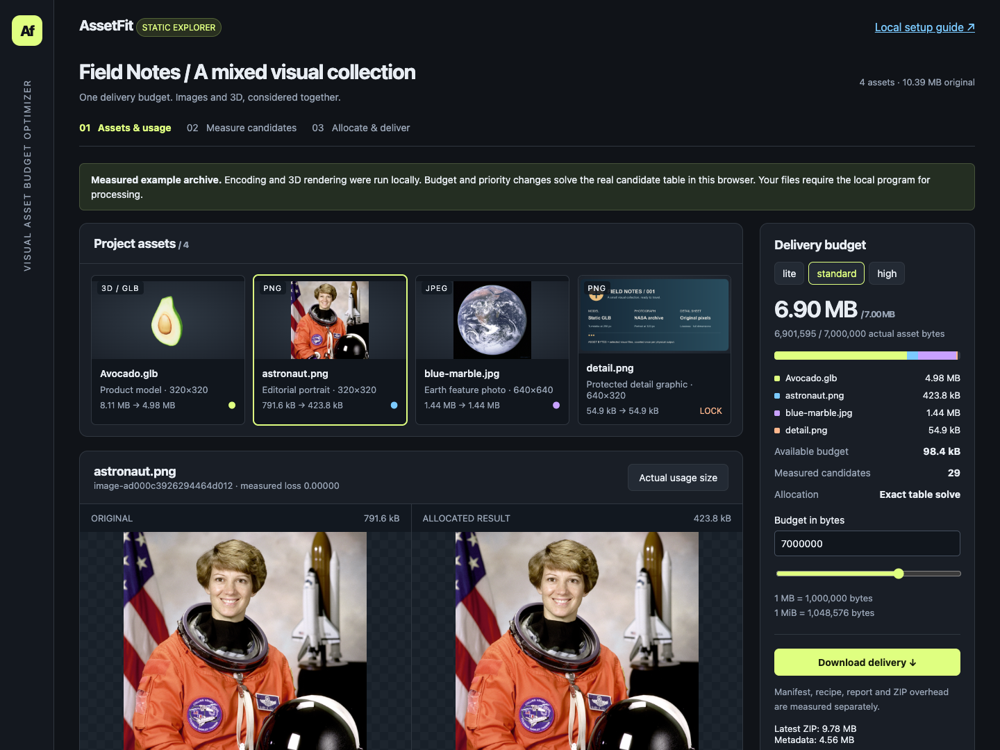

# AssetFit

**Fit images and static 3D models into one shared asset budget.**

Give AssetFit JPEG, PNG, WebP and self-contained static GLB files, describe where they will be displayed, and protect critical content. It generates and measures real versions, then chooses one version of every asset under a total byte limit. Images and models participate in the same allocation, so changing the budget or importance can move bytes between them.

The output is a delivery ZIP containing the selected files, an inspectable comparison report, a manifest with actual bytes and hashes, and a recipe for replay. Original inputs stay intact. The full application runs on your computer without a paid API or hosted processing service.



## Try it locally

Requirements: **Node.js 22.13+**, **pnpm 11.19.0**, and **Chrome or Playwright Chromium** for GLB evaluation. Image-only CLI processing does not need a browser.

From the directory containing your checkout:

```sh
cd assetfit
pnpm install --frozen-lockfile
pnpm build
pnpm start
```

Open [the local workspace](http://127.0.0.1:4318). If your checkout path contains spaces, quote it: `cd "my projects/assetfit"`.

1. Choose **New project**, then **Add files** or **Load sample**.
2. Set each asset's display size, importance and protection, then enter a total budget in bytes.
3. Choose **Generate & allocate**. Inspect the original, selected file and measured differences.
4. Adjust the budget or importance to reallocate measured candidates, then **Download delivery**.

If Chrome is unavailable, run `pnpm exec playwright install chromium`. If port 4318 is occupied, use `pnpm start --port 4319` and open the address printed in the terminal. If the first dependency installation fails, check `node --version`, `pnpm --version` and the reported registry/network or package error, then rerun the frozen install; keep the lockfile. See [setup and troubleshooting](docs/USAGE.md#setup-and-troubleshooting) for browser paths, the macOS launcher and recovery.

Validated environment: **macOS arm64, Node 24.19.0, pnpm 11.19.0, Chrome 152.0.7977.76**. Node 22.13 is the declared minimum; that version, Linux and Windows have not been validated for this release. [Release checks and remaining limits](docs/RC.md) record the actual verification scope.

## Local application and static demo

| | Full local application | Static demo |
| --- | --- | --- |
| Inputs | Your supported images and GLBs | Included real sample assets |
| Candidate generation and evaluation | New encodes and GLB renders on your computer | Clearly labeled precomputed candidates |
| Budget and importance changes | Joint allocation over measured candidates | The same allocator runs in the browser |
| New display conditions or protection | Regenerate or reevaluate as required | Use the local application |
| Delivery | Actual selected files, report and replay recipe | Actual selected sample files and recorded measurements |

The static build is in `dist/`; it needs no processing backend. It loads selected content as needed and can export a new selection from the existing candidate table. It does not simulate encoding or rendering progress. **This release candidate has not been publicly published; no external Demo URL is available yet.** The loopback link above works only on the computer running AssetFit.

## What the results mean

The hard budget is the **sum of actual selected visual-file bytes**. Embedded GLB textures are already counted inside the model. Reports, ZIP overhead, network transfer, GPU memory and frame rate are different quantities. One MB is 1,000,000 bytes; one MiB is 1,048,576 bytes.

The allocator minimizes a defined reference-based engineering loss over the valid candidate table. It is not a human visual-quality percentage or a claim of optimal encoding outside that table. Locks and protection remain constraints. If no measured combination fits, AssetFit reports that result and does not silently remove an asset or unlock it. Inspect critical details before using a delivery.

The supported scope is static 8-bit JPEG/PNG/WebP and self-contained static GLB 2.0 with supported core PBR content and `KHR_texture_transform`. Animation, skins, morph targets, other GLB extensions, external model resources, SVG and high-bit-depth images are rejected explicitly. [Supported inputs, protection and resource limits](docs/USAGE.md#supported-assets-and-protections) explain the boundary.

## Evidence and reproduction

- [Real mixed release case](docs/release-case.md): an 8.11 MB Avocado model, photographs and a protected graphic; exact input/output bytes, recipes, constraints, timings and reproduction commands. [Machine-readable record](docs/release-case.json).
- [Search comparison](docs/benchmark-notes.md): audited historical observations and a reproducible figure. Simple methods can win; 222 paid evaluations are not 222 unique outputs or proof of general superiority.
- [Release validation](docs/RC.md): clean installation, local processing, UI and static subpath checks, plus verified and unverified scope.
- [User guide](docs/USAGE.md): CLI, failure and recovery states, export, replay and policy. [Technical reference](docs/TECHNICAL.md): objective, cache validity and implementation limits.

Code: [MIT](LICENSE). Sample assets retain their own licenses and attribution in [`examples/SOURCES.json`](examples/SOURCES.json); the code license does not replace them. Publication status is tracked in the release report. Plotting dependencies are only needed to regenerate documentation figures, not to use AssetFit.
