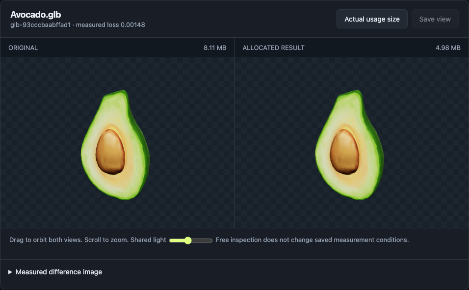
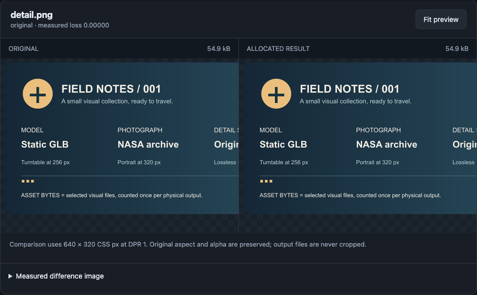
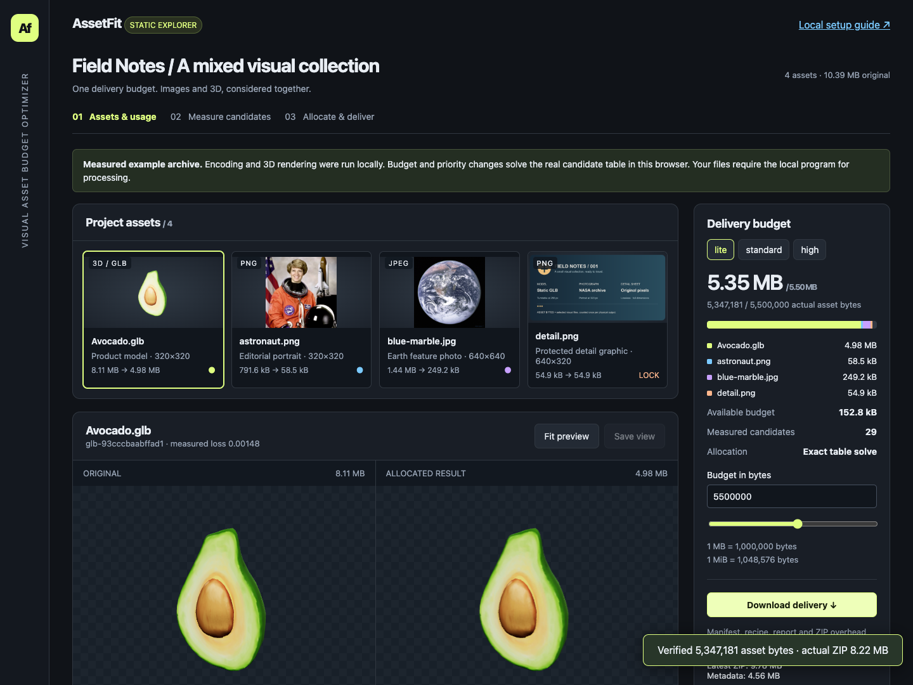

# AssetFit 0.1.0 — first release candidate

The local application and its static explorer are ready for review. This candidate has **not been pushed to an external repository or publicly deployed**. No public repository or Demo URL is asserted. The independent release checkout contains the application, pinned dependencies, licensed inputs, measured candidates, real screenshots and reproducible evidence. Its source code license is proposed as MIT for approval with the public release; sample licenses remain separate.

## Scope and repairs

This release continues the existing image/static-GLB application. Both resource types compete in the same integer-byte allocation problem. Every selected version corresponds to a real source-derived file, recorded recipe, actual byte count and SHA-256. GLB evaluation reloads the written file. Deliveries are independently reopened and checked.

The bounded audit fixed relative-output paths that could make moved projects fail, processing errors incorrectly reported as completed, and zero CLI exit status for failed/partial results. It added explicit port-occupancy errors, visible partial/failed states, exact integer asset-byte totals and display-use labels. Validation scripts now share the application's browser selection and fallback. The build retains notices for dependencies hidden inside JSZip's prebuilt browser bundle as well as direct imports.

These repairs do not change candidate encoding, metric or allocation semantics. Existing valid measurements remain valid. Historical projects that already contain absolute file references are not automatically migrated; keep them at their recorded location or replay into a new managed project. An old `complete` status from the repaired all-processing-failed condition is not proof of a successful run. [The core audit](rc-core-audit.md) records the affected scope and regressions.

## Main case and evidence

The main constructed demonstration contains 10,394,849 source bytes: a real Avocado GLB, two individually credited NASA photographs and an original-locked detail graphic. Four physical assets have five display uses. Twenty-nine actual candidates were measured; the portrait's repeated use is charged once and embedded model textures are counted inside the GLB.

| Budget in asset bytes | Delivered asset bytes | Constraint status |
| ---: | ---: | --- |
| 5,500,000 | 5,347,181 | Satisfied |
| 7,000,000 | 6,901,595 | Satisfied |
| 9,000,000 | 6,901,595 | Satisfied |

The last two budgets select the same outputs. Exhaustive enumeration of the 768 combinations in this measured table places the next lower-loss combination at 9,877,623 bytes. The predefined 8,500,000-byte model-versus-photo priority comparison changes both types. A 1 MB target and a separate all-original-locked project exercise failure paths without dropping assets or unlocking them. Every tier's exported files pass byte/hash/type checks; the delivered GLBs were also rendered again from their delivery paths.

Main optimization took 19.18 seconds; the recorded complete case took 33.42 seconds including additional output checks, a separate lock-failure project and initial demo assembly. Later packaging work is separately recorded. These are observations in one environment, not performance guarantees. [The case report](release-case.md) and [raw record](release-case.json) include per-asset recipes, loss components, candidate work, overhead, ZIP bytes and storage. The shipped archive retains all candidate files and one ready-made [standard delivery](../examples/release-demo/downloads/standard.zip); all tiers can be rebuilt from the existing table in the static explorer or regenerated locally with `pnpm release:case`.

The [search comparison](benchmark-notes.md) audits the historical 222 paid evaluations: 36 unique output hashes, 18 real ridge fits/proposals, and no cache hits in the corrected run. Uniform used five observations per run and other methods used eight. Greedy had the best Avocado mean diagnostic objective; ridge improved over evolution alone but did not beat greedy. The chart is explicitly a pipeline 1.0.1 historical result, not a rerun of every method on the release's 1.0.2 pipeline. The earlier failed run is retained. The prior 9/9 matching replay hashes establish only that particular source-bound replay in its recorded environment.

## Actual validation

[rc-verification.json](rc-verification.json) records the commands, results and current source hashes.

- **Clean installation:** a fresh temporary copy with a space in its canonical path, no copied `node_modules` or processing caches, and an independent empty pnpm store. Frozen installation, build, typecheck, `start.command`, HTTP access and a real CLI Duck-plus-photo run all passed. The independent delivery contains 157,920 / 180,000 asset bytes. The declared system browser is an external prerequisite. An initial verification-harness path issue involving macOS `/var` aliases was repaired before the successful fresh run.
- **Regression suite:** 50 passed, zero failures or skips, with real renderer tests enabled. This includes shared-reference protection, cache invalidation, moved-project replay/export, partial failure and cooperative cancellation. Strict checking covers the allocator/metric and shared interfaces; syntax checking covers the remaining application modules.
- **Local browser:** creating/importing/running a mixed project, closing the page during work, returning, immediately editing the budget and downloading a verified delivery passed. It produced 96,394 / 100,000 asset bytes. Shared-object locks propagated and made stale delivery controls unavailable. No uncaught page errors were recorded.
- **Static production:** a server exposing only `/assetfit/`, with no processing backend, verified all 29 candidate hashes, every fixed budget, live importance allocation, model selection, candidate recipes and the downloaded ZIP. At the tested 5.5 MB budget, raising model importance did not change the selected files; the result still exactly matched the allocator. A one-byte budget disabled export. All resource paths stayed under the project subpath, and the 390 px layout had no page overflow.
- **Initial loading:** the production candidate-table JSON is 227,290 bytes. The initial view requested two of 29 candidate files and zero GLBs; clicking a model loaded its actual original and selected GLB. The local uncompressed test observed 3,582,935 response-body bytes across app code, metadata and images. That is a page-load accounting observation, not the asset budget or a public-network timing claim.

The successful environment was macOS arm64, Node 24.19.0, pnpm 11.19.0 and Chrome 152.0.7977.76 with SwiftShader. The declared minimum Node version is 22.13, matching the package manager's requirement. Node 22.13, Linux, Windows, arbitrary GPUs and cross-machine identical rendering have not been verified. GitHub Actions workflows have been prepared but have not run remotely. They must pass before a public deployment is described as verified.

## Real interface captures

These are browser screenshots of the shipped candidate archive, not design mockups. The displayed bytes and selections are validated by `pnpm verify:demo`.








## Reproduce the bounded checks

From the repository root, after installing the README prerequisites:

```sh
pnpm install --frozen-lockfile
pnpm build
pnpm typecheck
ASSETFIT_RENDER_TESTS=1 pnpm test
pnpm verify:demo
pnpm verify:local
pnpm verify:clean
```

The browser checks create actual files in ignored `artifacts/`. The clean check retains its temporary directory location only in its ignored local log. `pnpm release:case` regenerates the main case; this and `pnpm benchmark` are deliberate experiments, not required to install or experience the shipped archive. Plot reproduction uses the separate documented Python environment.

## Publication preparation

The release checkout is an independent Git repository. The unrelated parent repository and other projects were left intact. Source modules, build/verification scripts, workspace settings, the executable launcher, lockfile, input provenance and every required demo file are included. Dependencies, caches, private managed projects, development artifacts and the superseded small generated archive are excluded.

`.github/workflows/check.yml` prepares install/test/build/static verification. `pages.yml` is manual: it builds and checks the static artifact before the deploy job. It follows [GitHub's custom Pages workflow](https://docs.github.com/en/pages/getting-started-with-github-pages/using-custom-workflows-with-github-pages) and the [project-site subpath model](https://docs.github.com/en/pages/getting-started-with-github-pages/what-is-github-pages). Source repository creation, its public visibility, the proposed code license and actual deployment remain subject to the requested publication approval. A local build, a pushed repository, a successful deployment and an externally reachable site are separate states.

Finite candidates, declared cameras, explicit supported GLB extensions and resource caps remain practical limits. No new server, cloud upload service, PDF/video product line or expanded experimental matrix was added for this candidate.
