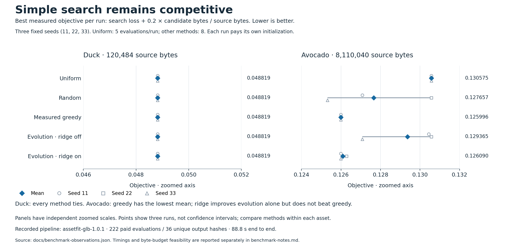

# GLB search benchmark

The saved benchmark compares Duck and Avocado using three fixed seeds (11, 22, 33). Both models have one geometry and one eligible color-texture variable, each with five levels. All methods independently measure the original and four uniform configurations. Uniform stops there; the other methods allow eight evaluations per run. No observations are shared between runs.

Evaluation uses 256 × 256 rasters at DPR 1, three original-derived cameras and the same lighting and metric. Each proposal is encoded, validated, reloaded and rendered. Avocado's normal/ORM maps remain unchanged. Scores use search views only.

## Saved results

The historical run used `assetfit-glb-1.0.1`, `three-180-fixed-v1` and `rgba-reference-v1` on macOS arm64, Node 24.19.0 and Chrome 152.0.7977.76 with SwiftShader. It has 222 evaluations across 30 runs and 36 unique output hashes. The table shows the mean `loss + 0.2 × bytes / source bytes` over all three seeds; lower is better. This is a comparison of the measured archives under a common maximum allowance, with different realized evaluation counts.



| Method | Duck | Avocado |
| --- | ---: | ---: |
| Uniform | 0.048819 | 0.130575 |
| Random | 0.048819 | 0.127657 |
| Measured greedy | 0.048819 | 0.125996 |
| Evolutionary, surrogate off | 0.048819 | 0.129365 |
| Evolutionary, ridge on | 0.048819 | 0.126090 |

Duck tied on this objective. Measured greedy had the best Avocado mean; ridge-assisted evolution improved on evolution alone but did not beat greedy. No run found an Avocado candidate at the 25% or 50% byte budgets. These results concern two models and fixed views, not a general visual-quality ranking.

The run took 88.811 seconds end to end. Method order was fixed and candidate workloads differed, so timings do not establish a controlled speedup. Full per-run results, budgets and costs are in [benchmark-results.json](benchmark-results.json); all observation events are in [benchmark-observations.json](benchmark-observations.json). The [initial run](benchmark-initial-run.json) retains 81 failed Duck candidates from the earlier UV adapter bug. The saved corrected run predates the current GLB pipeline.

## Reproduce

After installing application dependencies and Chrome or Playwright Chromium, `pnpm benchmark` runs a new physical comparison. `ASSETFIT_BENCHMARK_EVALUATIONS` changes the default eight-evaluation ceiling and is recorded in the output.

To rebuild only the figure and derived [summary](benchmark-audit.json) from the saved observations:

```sh
python3 -m venv .cache/chart-env
.cache/chart-env/bin/python -m pip install -r scripts/plot-benchmark-requirements.txt
.cache/chart-env/bin/python scripts/plot-benchmark.py
```

Python 3.12 and the pinned plotting dependencies produce the supplied figure. They are not application dependencies. `--extract artifacts/benchmark.json` reads a full local run and verifies its candidate files before rebuilding the portable observations; those candidate files must be present.
